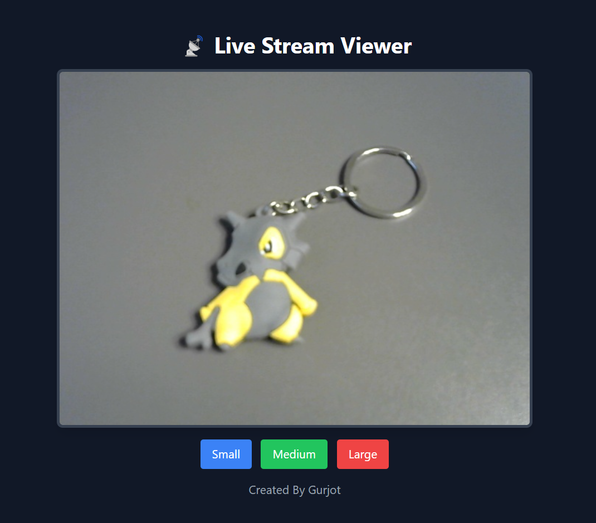

# **Real-Time Video Streaming with Flask-SocketIO**  

This project enables real-time video streaming using **Flask-SocketIO** and a production-ready WSGI server. It allows multiple clients to transmit video frames to a server, which then distributes them to connected users.

---

## **🔹 Features**  
- ✅ Real-time video transmission using **Flask-SocketIO**  
- ✅ Supports both **local and networked streaming**  
- ✅ Works with **multiple clients** (expandable with minor modifications)  
- ✅ Can be deployed with **eventlet, gevent, or uWSGI**  
- ✅ Lightweight and easy to extend  

---

## **📌 How It Works**  

- Clients send video frames to the server using **Flask-SocketIO**.  
- The server relays these frames to connected clients in real time.  
- Supports **single-device, local network, or remote network** streaming.  

---

## **🚀 Getting Started**  

Follow these steps to set up and run the **Real-Time Video Streaming with Flask-SocketIO** project.  

---

## **📽️ UI**  

Add to **any project**.


---

### **1️⃣ Prerequisites**  

Ensure you have the following installed on your system:  
- **Python 3.7+** (Recommended: Python 3.10+)  
- **pip** (Python package manager)  
- A **web browser** (e.g., Chrome, Firefox)  

To check if Python is installed, run:  
```bash 
python --version
```

### **2️⃣ Clone the Repository**  

Download the project by cloning the repository:  
```bash
git clone https://github.com/your-username/video-streaming-flask.git
```

### **3️⃣ Create a Virtual Environment (Optional but Recommended)**  

Create & Activate Virtual Environment:  
```bash
python -m venv venv
venv\Scripts\activate
```

### **4️⃣ Install Dependencies**  

Install the required Python dependencies: 
```bash
pip install -r requirements.txt
```

### **5️⃣ Run the Server**  

Start the Flask server: 
```bash
python server.py
```

